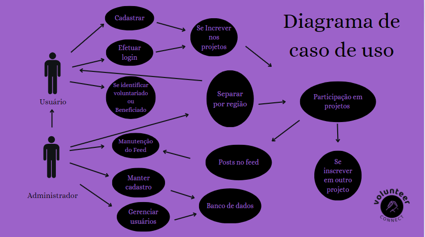

# Especificações do Projeto
Uma aplicação projetada para conectar diversas pessoas que possuem demandas e objetivos em cima do mesmo tópico: trabalho voluntário. Com o propósito de facilitar a interação entre voluntários e pessoas que necessitam de algum auxílio, o projeto consiste em desenvolver uma plataforma que assegura que os usuários se cadastrem e se identifiquem como voluntários ou beneficiários e, assim, conecta ambos os lados de acordo com a compatibilidade entre os perfis. 
  Para isso, é necessário que essa aplicação seja totalmente responsiva, de forma a tornar-se acessível para todos os tipoS de aparelhos eletrônicos e pessoas. Ademais, o sistema deve permitir classificar os usuários entre Voluntários e/ou Beneficiados, por meio do cadastro de usuários com login e senha e sua incrição em projetos. Ainda, essa aplicação conta com o empenho e dedicação de cada integrante do grupo. 
  Dessa forma, espera-se um resultado positivo e satisfatório em relação ao projeto.

## Linguagens Utilizadas
• Front-end: HTML + CSS, Bootstrap;  
• Back-end: não será utilizado nesta aplicação. 

## Personas
• Persona 1: João, 19 anos, estudante tentando ingressar em uma universidade pública para concluir o ensino superior, classe média-baixa. 
João é um estudante que está se esforçando para conseguir ingressar em uma universidade pública, entretanto, devido à falta de recursos e por questões financeiras, não conseguiu realizar o seu sonho ainda. João passa meio período do dia trabalhando para uma empresa de fastfood, mas seu salário é escasso e é utilizado para ajudar sua mãe com as contas de casa. Dessa forma, ele necessita de uma aplicação que o conecte a grupos de estudo gratuitos, que atuam como "pré-vestibular" e que ofereçam assistência a jovens que enfrentam o mesmo problema de João. Seus hobbies incluem tocar violão, ler e fazer caminhadas. 

• Persona 2: Ana, 45 anos, professora, classe média. 
Ana é uma professora do ensino fundamental que está interessada em se envolver em trabalhos voluntários relacionados à educação infantil. Ela é de uma família de classe média e tem filhos adolescentes. Seus hobbies incluem jardinagem, cozinhar e viajar.  
Como professora de uma instituição pública, Ana se depara com diversos alunos que possuem dificuldades na escola, e tais dificuldades não são superadas devido à precariedade do ensino público. Com isso, ela se empenha em ajudar esses alunos e deseja que seu auxílio alcance mais pessoas na região onde vive. Dessa forma, Ana necessita de uma aplicação que forneça um acesso facilitado a grupos de pessoas que precisam de ajuda nos estudos, de forma a conseguir se conectar com esses indivíduos para ajudá-los.

• Persona 3: Carlos, 75 anos, aposentado, classe média. 
Carlos é um aposentado que trabalhou como operário em uma empresa de fabricação de tubos por muitos anos, chamada Vallourec. Devido às condições de trabalho as quais foi submetido, ele se encontra debilitado e não está apto a realizar trabalhos braçais. Recentemente, sua casa foi inundada após uma forte sequência de chuvas e, consequentemente, uma parte de sua habitação foi destruída e, agora, ele necessita de pessoas que o ajudem a reconstruí-la.  
Carlos afirma que possui os materiais necessários para a reforma, mas por uma questão financeira, não consegue arcar com os custos de contratar uma pessoa para operar esta obra.  Dessa forma, Carlos precisa ter acesso a uma aplicação que o possibilite a encontrar pessoas que se disponibilizam a ajudar na reforma de sua casa.  

• Persona 4: Gabriela, 28 anos, Designer Gráfico,  classe média-alta. 
Gabriela já atuou em diversos trabalhos voluntários, principalmente na sua cidade natal, onde ajudou em um abrigo para animais abandonados e também em uma organização que fornece alimentos para pessoas em situação de rua. Ela também participou de um projeto de recuperação de áreas verdes. 
Gabriela acredita que é importante retribuir à comunidade e fazer a diferença na vida das pessoas. Além disso, ela tem habilidades em design gráfico e gostaria de usá-las para ajudar organizações a criarem campanhas e materiais de comunicação mais eficazes. Ela também quer se conectar com outras pessoas que compartilham seus valores e interesses.  
Gabriela está procurando por uma aplicação que ofereça uma ampla variedade de oportunidades de voluntariado, onde ela possa encontrar algo que se adapte às suas habilidades e agenda. Ela espera que essa aplicação seja fácil de usar e permita que ela se conecte com organizações sem fins lucrativos e outros voluntários de maneira eficiente. Ela também espera que a aplicação forneça informações claras sobre as expectativas e as responsabilidades de cada oportunidade de voluntariado, para que ela possa escolher uma que atenda suas expectativas.
 
|EU COMO... | QUERO/PRECISO... | PARA... |
|------|-----------------------------------------|----|
|Usuário - Voluntário/ONG| Quero ter acesso a pessoas/ONGs/Instituições que necessitem de ajuda | Para que eu possa me voluntariar |
|Usuário - Voluntário/ONG| Preciso ter acesso a informações sobre serviços e demandas na região em que moro | Para que eu possa prover ajuda e auxílio |
|Usuário - Voluntário/ONG| Preciso ter acesso a um banco de dados atualizado e revisado com as informações de todos os beneficiários | Para que eu saiba onde me cadastrar |
|Usuário - Voluntário/ONG| Preciso ter acesso às informações relacionadas à localização e carência do beneficiário | Para que eu me inscreva em algum projeto que esteja ao meu alcance |
|Usuário -  Voluntário/ONG| Quero ter acesso a uma lista revisada e atualizada sobre os processos pendentes | Para que eu saiba como e onde prover ajuda |
|Usuário -  ONG/Benefciário/Instituição| Quero ter acesso a pessoas que estão dispostas a ajudar | Para que eu possa receber assistência para o meu problema |
|Usuário -  ONG/Beneficiário/Instituição| Preciso ter acesso a um banco de dados atualizado com as informações de todos os voluntários | Para saber quais voluntários estão ainda disponíveis |
|Usuário -  ONG/Beneficiário/Instituição| Quero ter acesso a uma lista com informações sobre o voluntário, sobre sua localização e o serviço fornecido | Para que eu possa receber a assistência necessária |
|Administrador| Quero investir recursos e esforços no desenvolvimento da aplicação | Para que haja sucesso ao final do projeto |
|Desenvolvedor| Quero desenvolver uma aplicação responsiva e intuitiva | Para que a aplicação se torne acessível a todos |

## Requisitos Funcionais
|ID    | Descrição do Requisito  | Prioridade | Responsável |
|------|-----------------------------------------|----| ----|
|RF-001| O sistema deve permitir cadastrar usuários com login e senha|  ALTA | Lucas Vieira |
|RF-002| O sistema deve permitir classificar os usuários entre Voluntários e/ou Beneficiados | ALTA | Lucas Vieira |
|RF-003| O sistema deve permitir que usuários Beneficiados cadastrem Projetos | ALTA | Gustavo Amaral |
|RF-004| O sistema deve permitir que usuários Voluntários se inscrevam em Projetos |  ALTA | Gustavo Amaral |
|RF-005| O sistema deve permitir classificar os Projetos em Área de Motivação | MÉDIA | Otávio Nunes |
|RF-006| O sistema deve permitir filtrar os Projetos por classificações listadas acima e por região geográfica | ALTA | Otávio Nunes |
|RF-007| O sistema deve permitir que usuários beneficiados façam atualizações do andamento do Projeto | MÉDIA | Eduarda Faria |
|RF-008| O sistema deve permitir que usuários beneficiados confirmem a participação de voluntários no Projeto | BAIXA | Eduarda Faria |
|RF-009| O sistema deve proporcionar uma tela de interação entre os usuários, com o nome de Feed, para a postagem de fotos | MÉDIA | Eduarda Faria |
|RF-010| O sistema deve permitir que os usuários façam novos posts de fotos referentes aos trabalhos realizados | MÉDIA | Eduarda Faria |
|RF-011| O sistema deve proporcionar uma tela de interação entre os usuários e os profissionais de atendimento da empresa | MÉDIA | Giovanna Vaz |
|RF-012| O sistema deve permitir que o usuário tire dúvidas virtualmente com os assistentes da empresa | MÉDIA | Giovanna Vaz |
|RF-013| O sistema deve proporcionar uma tela de informações sobre a empresa | BAIXA | Giovanna Vaz |
|RF-014| O sistema deve fornecer meios de contato entre a empresa e o usuário | BAIXA | Giovanna Vaz |
|RF-015| O sistema deve permitir que o usuário altere ou recupere seus dados  | MÉDIA | Giovanna Vaz |
|RF-016| O sistema deve proporcionar uma tela de perfil particular para que cada usuário consiga ter acesso aos seus dados frequentemente | MÉDIA | Gustavo Amaral |
|RF-017| O sistema deve fornecer uma tela inicial que contenha atalhos para as outras páginas, como login, cadastro, perfil pessoal, informações da empresa, etc | MÉDIA | Letícia Gabriela |

### Requisitos não Funcionais
|ID    | Descrição do Requisito  | Prioridade | Responsável |
|------|-----------------------------------------|----| ----|
|RNF-001| O sistema deve parar 5 vezes ao ano para manutenção e funcionar no restante do tempo | BAIXA | Giovanna Vaz |
|RMF-002| O sistema deve abrir o login em 2s | BAIXA | Letícia Gabriela |
|RNF-003| O sistema deve fazer backup incremental diário| BAIXA | Letícia Gabriela |
|RNF-004| O sistema deve ser acessado via cloud | BAIXA | Gustavo Amaral |
|RNF-005| O sistema deve ser responsivo | ALTA | Giovanna Vaz |
|RNF-006| O sistema deve fechar os projetos concluídos ou que tenham data de validade | MÉDIA | Letícia Gabriela |
|RNF-007| O sistema deve emitir um certificado para os voluntários que tenham a participação confirmada |MÉDIA| Letícia Gabriela |

## Restrições
•	O projeto deverá ser entregue até o final do semestre; 
•	O projeto não poderá ser desenvolvido um módulo de backend; 
• O sistema deverá estar em conformidade com os parâmetros instituídos pela lei nº 12.965, denominada Marco Civil da Internet. 
• Ao final do semestre, deverá ser entregue uma aplicação que forneça acesso facilitado a todas as pessoas, englobando todas as idades, classes sociais e gêneros.

# Diagrama de caso de uso

