# Projeto de Interface

## User Flow

## Wireframes
Página inicial:
 
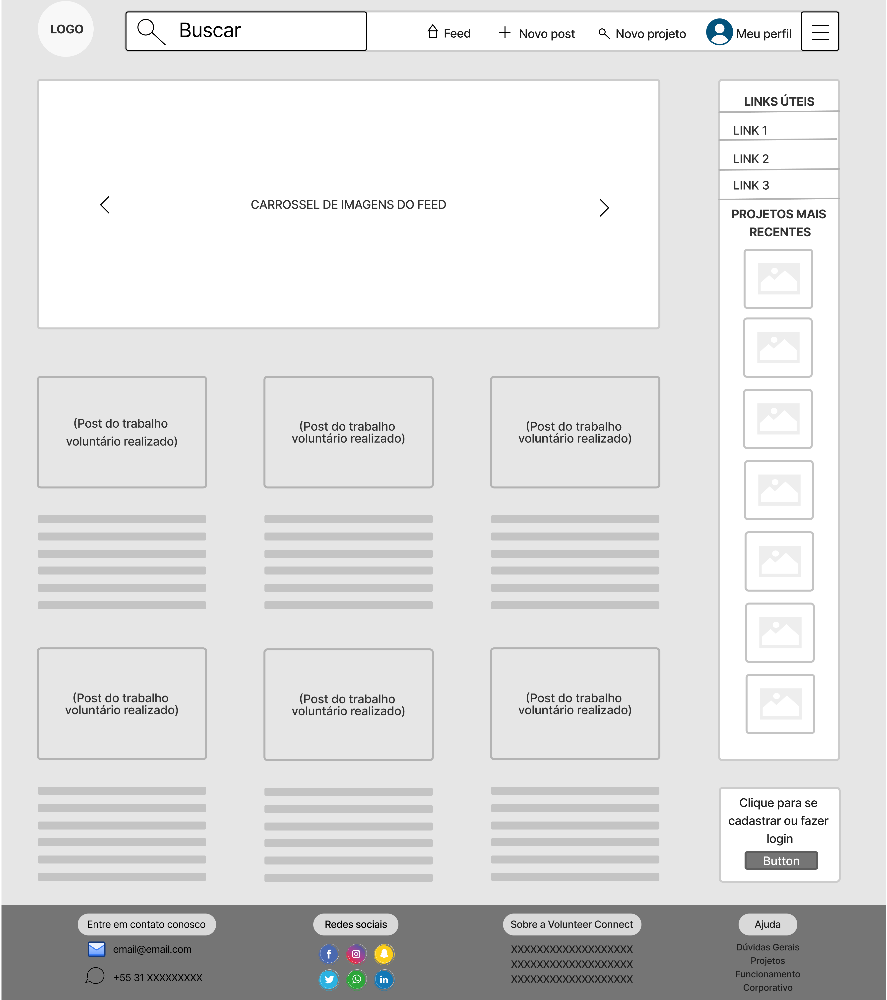
 
Pagina inicial versão mobile:
 
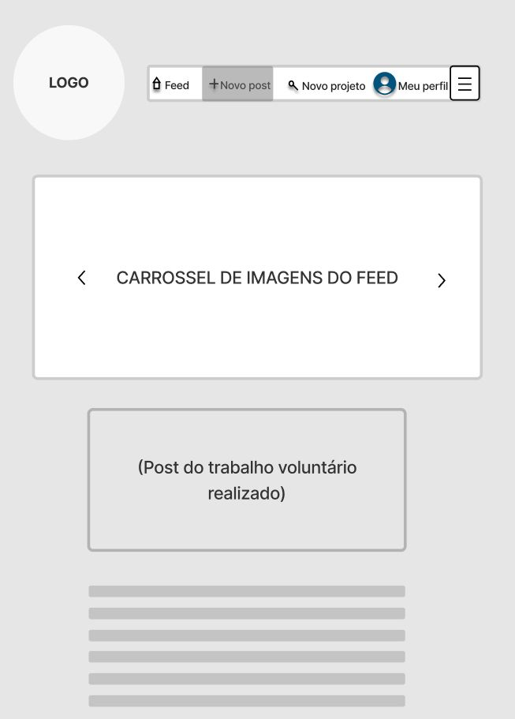

Central de Ajuda:
 
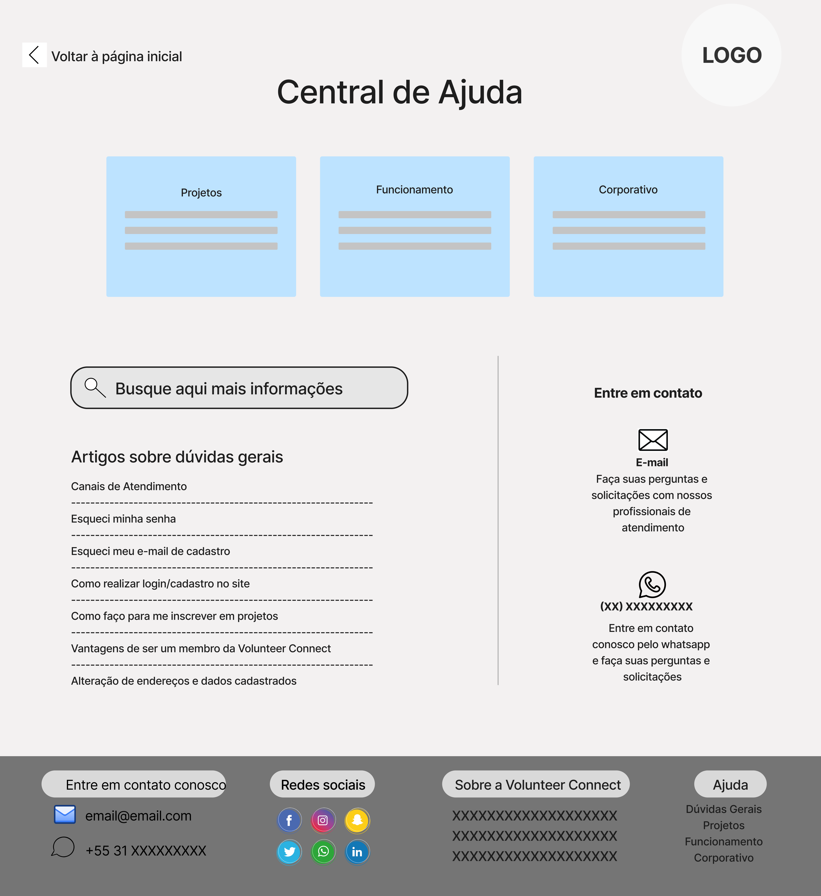
 
Central de Ajuda mobile:
 
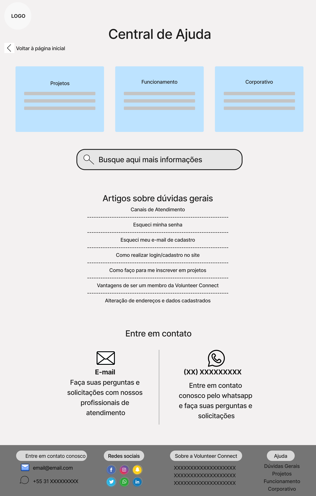
 

Login ou Cadastro:
   

   
Login ou cadastro mobile:
   

   

Login:
   

  
Login mobile:
   

   

Cadastro:
   

  
Cadastro mobile:
   

   
 
 Meu perfil:
   
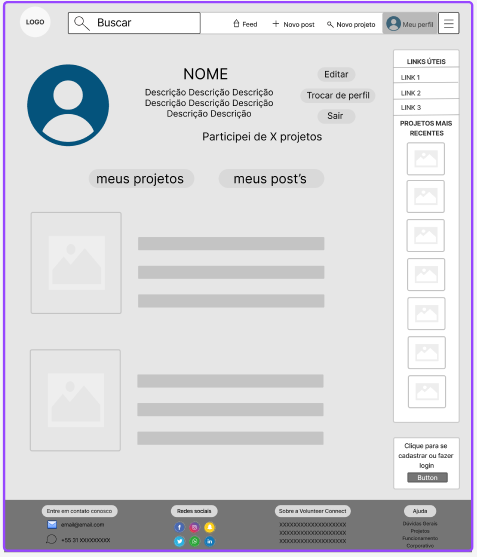
 
Meu perfil mobile:
   
 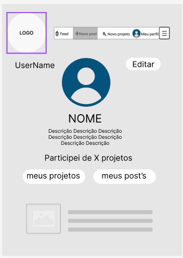
  
Feed:
 
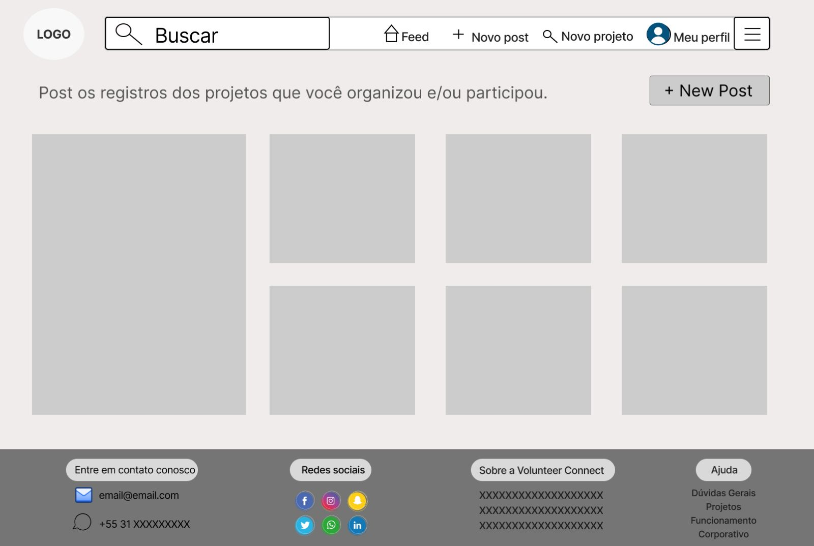
 

Feed versão mobile:
 
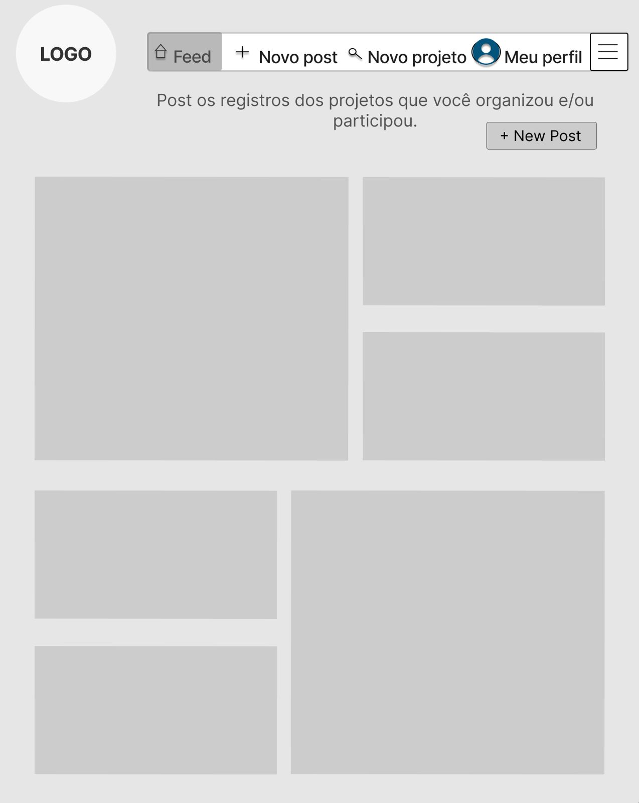
 

Novo post:
 
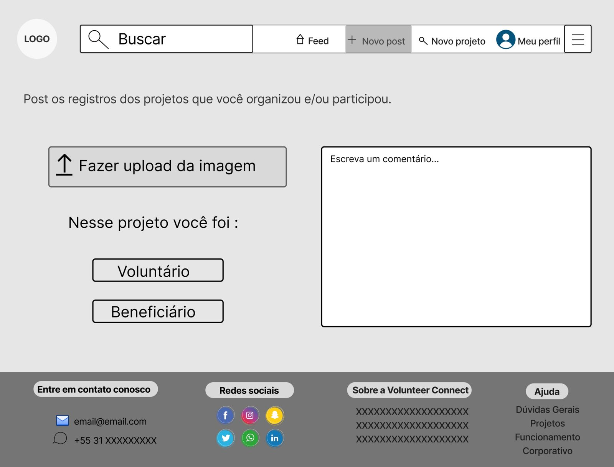
 

Novo post versão mobile:
 
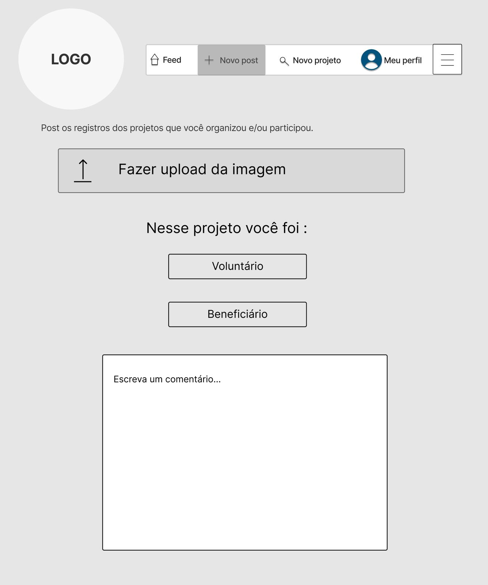
 

Novo projeto:
 
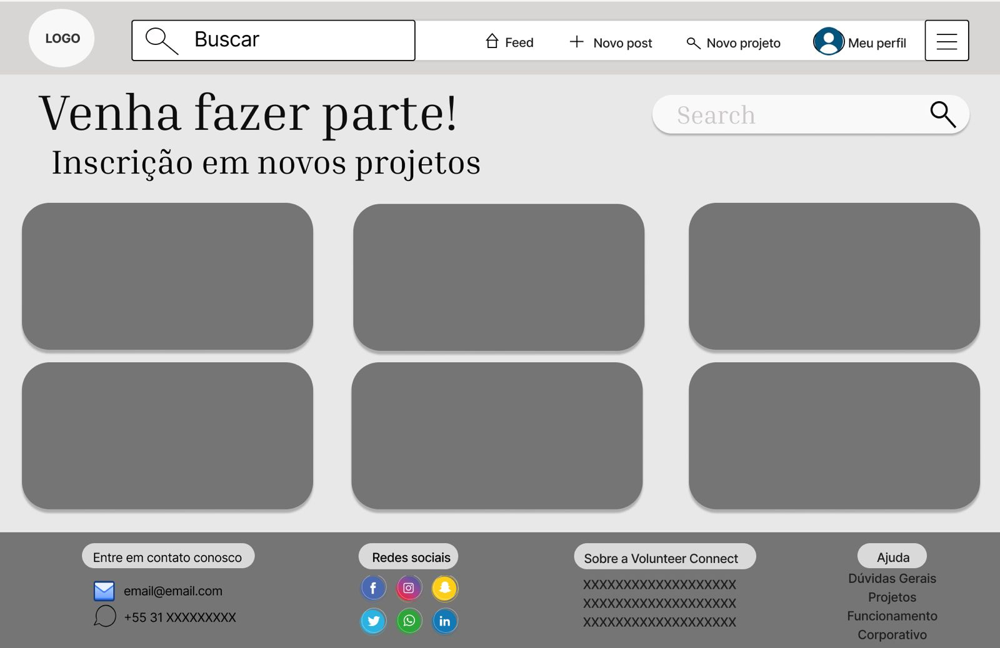
 
Novo projeto versão mobile:
 
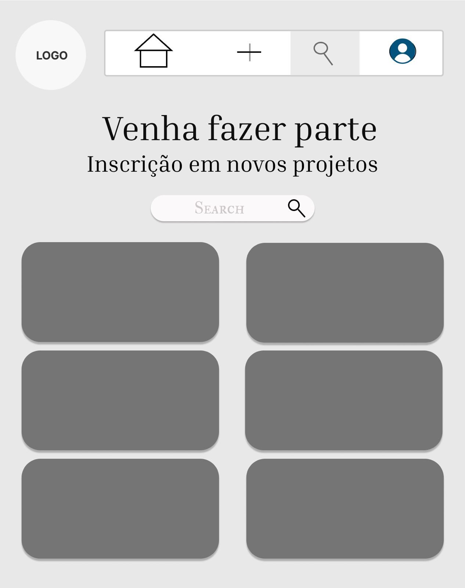
 
Preferências:
 
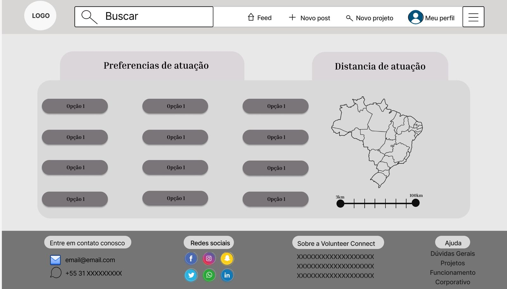
 
Preferências versão mobile:
 
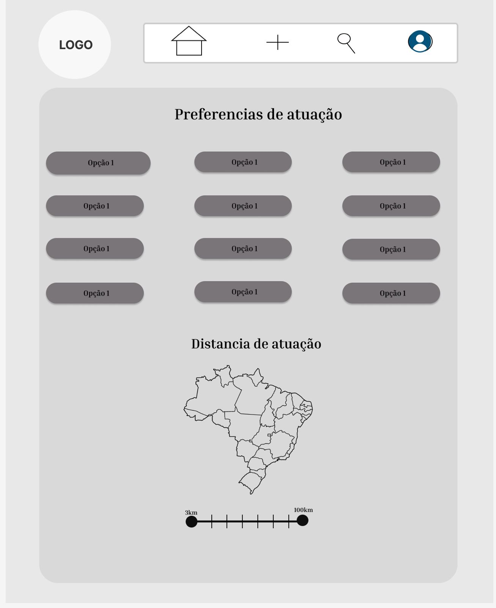
 

